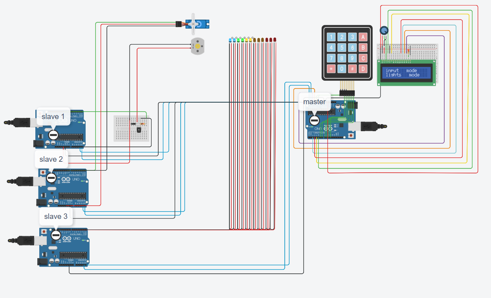

# Home-Automation-Machenism
this is a simulation of a basic home automation system that uses keypad inputs to send output signal to respective actuator that are meant for respective functions

## **LIST of devices used**
- arduino board
- 4x4 keypad
- 16 pin LCD display
- breadboards
- 250 kohm potentiometer
- NPN transistor
- diode
- 1 kohm resistence
- servo
- dc motor
- led

the system uses concept of master-slave arduino system and simple lcd, keypad interface. each slave is marked and connected to master arduino and are given their respective address to initiate I2C protocol.

## for master arduino
use serial input to enter 1, 2 ,3 for lights, fan, curtain/gates respectively. ones modes are entered they can be seen on LCD csreen itself.Further use the keypad to entel the level of the input i.e  1-5 . 0 on the keypad can be used to off the device. 

below is the picture of system in lights mode with lights at level 3

