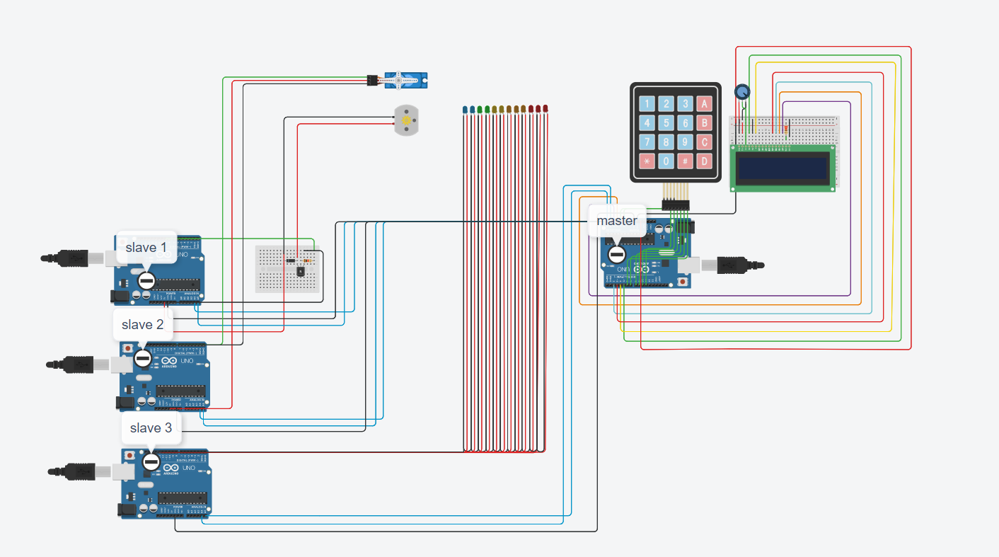

# Home-Automation-Machenism
this is a simulation of a basic home automation system that uses keypad inputs to send output signal to respective actuator that are meant for respective functions

## **LIST of devices used**
- arduino board
- 4x4 keypad
- 16 pin LCD display
- breadboards
- 250 kohm potentiometer
- NPN transistor
- diode
- 1 kohm resistence
- servo
- dc motor
- led
